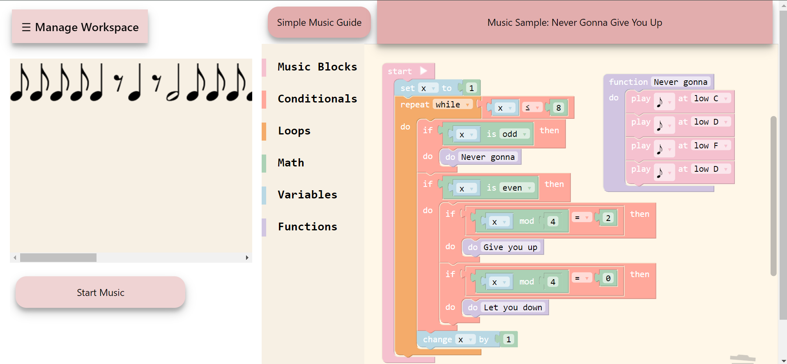
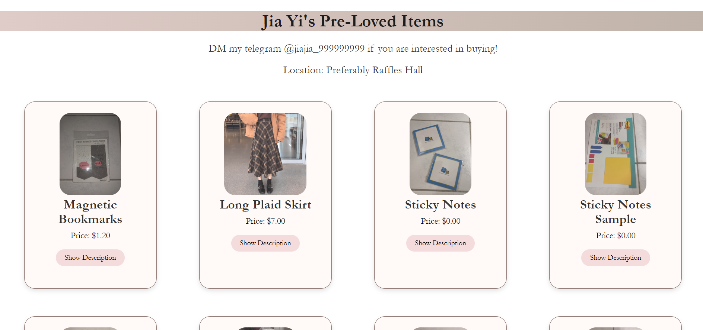
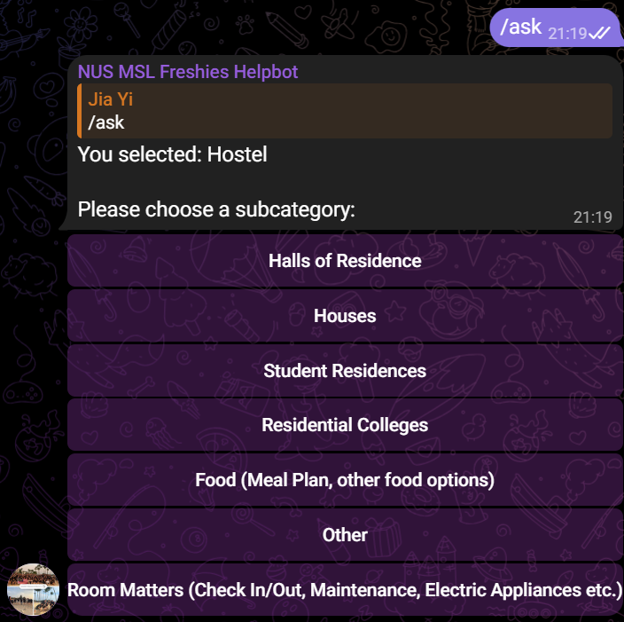
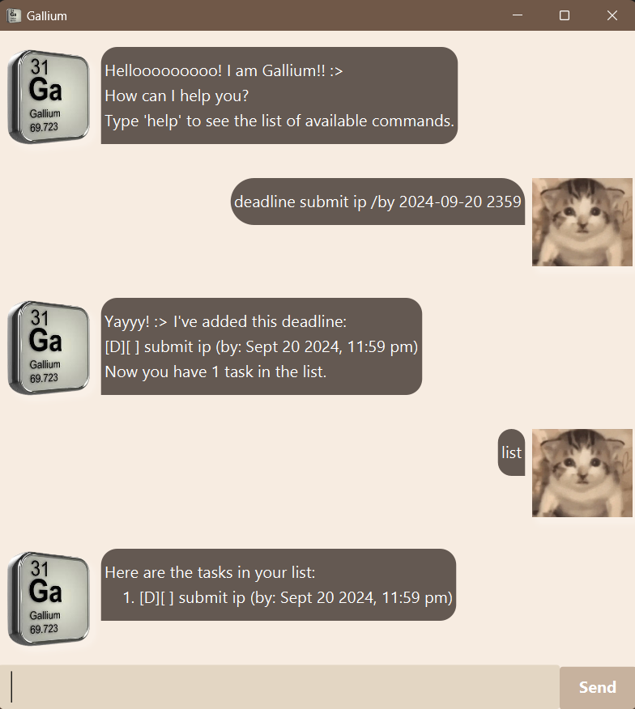
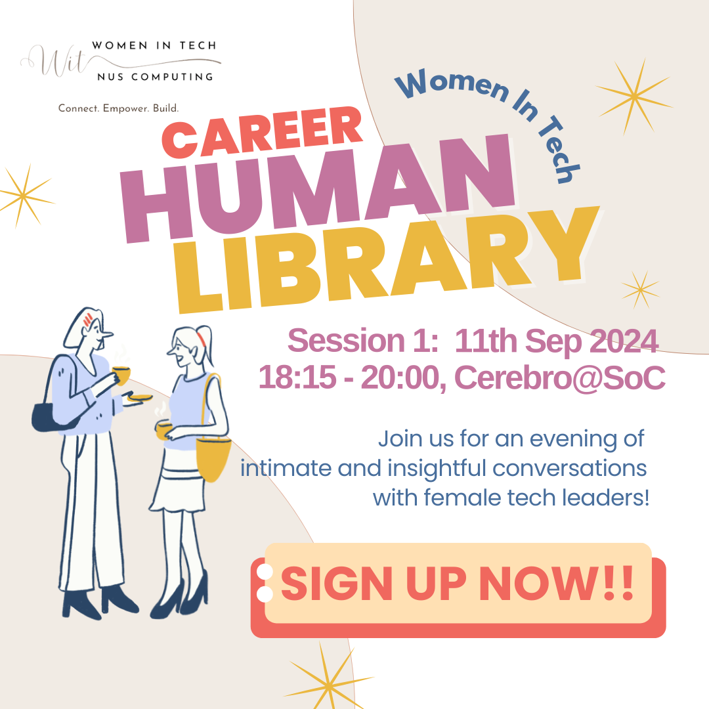
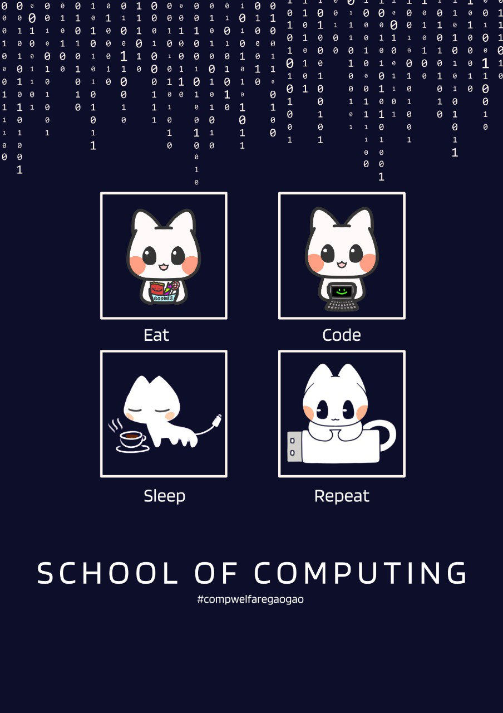

# Jia Yi's Portfolio

Welcome to my portfolio! Here you'll find a collection of my projects in software development, design and content creation.

## Software Development Projects

### [NUS Orbital Project](#)
* **Description:** A software platform that allows users to create music using coding blocks, combining artistic expression and computational thinking.
* **Technologies:** React, Javascript, CSS, Vercel, Django, Railway, Render
* **Link:** [View Project](https://algorhythm-milestone2.vercel.app/)
* 

### [Personal Website](#)
* **Description:** A personal website to sell second hand items.
* **Technologies:** React, CSS, Firebase
* **Link:** [View Project](https://2ndhand-tawny.vercel.app/) (Link not accessible through NUS WiFi)
* 

### [Freshies' Helper Telegram Bot](#)
* **Description:** A Telegram bot to assist NUS freshies in accessing 100+ FAQs about hostel application, QET and student pass information.
* **Technologies:** Python, Supabase, Telegram Bot API
* **Bot Username:**  @mslfreshies_bot (Click this [link](https://api.render.com/deploy/srv-cptv1pl6l47c7383pcog?key=Cpf6YeHVqFc) to activate the bot before using it.)
* 

### [CS2103T - Software Engineering Project - Task Manager Chatbot](#)
* **Description:** A todos, deadlines and events manager chatbot.
* **Technologies:** Java, JavaFX
* **Link:** [View Project](https://github.com/JiaYi-Gallium369/ip)
* 

## Design Projects

### [NUS Women in Tech - Publicity Associate](#)
* **Description:** Created posts for upcoming Women in Tech events.
* 
* 

### [NUS Computing Club - Publicity Subcommitee](#)
* **Description:** Designed a folder as welfare for NUS computing students.
* 

## Content Creation

### [Xiao Hong Shu Personal Account](#)
* **Description:** Personal Xiao Hong Shu (Chinese social media app) account, used Canva to design and post NUS application related content here to engage with more incoming freshies.
* **Link:** [Xiao Hong Shu](https://www.xiaohongshu.com/user/profile/63e5f4e4000000002702a8b7?xhsshare=CopyLink&appuid=63e5f4e4000000002702a8b7&apptime=1720152918&share_id=b390fed092534a9685e9c69458196a53&tab=note)

